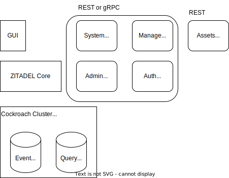
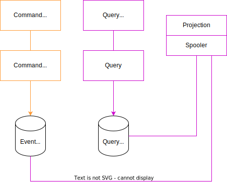

# ZITADELをセルフホストする

# ZITADELのsoftware Architecture

https://zitadel.com/docs/concepts/architecture/software

CQRS, イベントソーシング
結果整合性を持つ

アーキテクチャ概要

ZITADLE Core

## Service layer→おそらく青色の枠

- HTTP server  
    GUI系を提供してる　
    - Server side Pages
    - console
    - Static Assets

- API Server
    エンドポイントはgRCP、gRPC-web 、RESTの形式で提供されてる
    OpenID Connect & OAuth, Asset APIは違う。
    - OpenID Connect & OAuth - ZITADELの認証と認可をリクエストできる
    - SAML - SAMLで認証と認可をリクエストできる
    - Authentication API - ログイン済みのユーザーに対する操作ができる
    - Management API - 組織単位でリソース管理を行うためのAPI
    - Administration API - インスタンスレベルでのリソース管理を行う
    - System API - 新しい ZITADELインスタンスを作成・変更 するためのAPI
    - Asset API - 静的アセット(ロゴ、証明書など)のアップロード・ダウンロード に使用されるAPI

## core layer

### Command Handler
Command Handlerは、ZITADELによって管理されるリソースを変更するすべての操作を受け取る

Command Validationは、受信したコマンドを使用してビジネス ロジックを実行し、特定のアクションを実行できるかどうかを確認

リアルタイムで処理する必要があるイベント→メモリ内のpub/sub
一部のイベント→spoolerを利用してイベントを処理する
外部MQを使わないのは可用性の保証に悪影響を与えるかららしい

### spooler

ZITADEL内で非同期タスクを処理するためのワーカー（Worker）機構  

### Projections

データをクエリ側で扱うための整理を担当

### Query

可用性とパフォーマンスを選択し、一貫性は除外
クエリ側の要件
- クエリが簡単に行える必要がある
- 応答時間が短いことが必須です (API サーバー上のクエリの 80% が 100 ミリ秒未満)
- 高負荷時でも可用性は高くなければならない
- クエリビューはほとんどのリクエストに対して永続化できなければならない

Query Handlerは読み取りに関する操作を受け取る  
QueryはQuery Handlerからの要求をストレージに実行できるか、チェックする

## Storage

ZITADEL は現在、PostgreSQL と CockroachDB をサポート  
ストレージの選定基準  
https://zitadel.com/docs/self-hosting/manage/production#prefer-postgresql

パフォーマンスとレイテンシを優先したい場合は、PostgreSQL を使用すること  
複数リージョンのデータのローカリティが重要な要件である場合は、CockroachDB が適切なオプションになる可能性がある
データベースのインデックスは、PostgreSQL を使用する ZITADEL Cloud のロードテストを通じて最適化されてる

## イベントストア  
https://zitadel.com/docs/concepts/eventstore/overview

データは追記専用のログ(append-only log)として保存
現在の状態を取得するには、すべてのイベントを集計すればよい ため、データの最新状態を正確に把握  
過去の変更履歴を確認する場合、特定の時間範囲のイベントを取得するだけでよい ため、監査や分析が非常に強力
全ての変更が無制限に記録される監査ログが組み込まれている ため、システムの履歴を完全に追跡できる  

## デプロイ戦略

Postgresqlの例はなかった

### 単一クラスタ

### マルチクラスタ

## Secretの扱い

- 自動ローテーション  
シークレットは一定の感覚で自動的に更新され、古いシークレットの使用を防ぐ  
- 有効期限の制限  
期限の切れたシークレットを無効化する    
- 一度だけ表示 (Show Only Once)   
これよくわからん  
シークレットは一度だけ表示され、再取得できない  
- 公開鍵/秘密鍵の概念を優先 (Prefer Public/Private Key Concepts)  
- シークレット/パスワードの非可逆ハッシュ化 (Irreversible Hash Secrets/Passwords)  
- シークレットストレージの暗号化 (Encrypt Secrets Storage)  
ZITADEL のシークレットストレージでは、AES256 による暗号化がされてる  
データベース内の情報が直接抜き取られた場合でも、解読されにくくなる  
- 安全でないチャネルを通じて送信する場合の強制変更 (Forced Change Through Receiver)  
メールや SMS などの安全でないチャネルを介してシークレットを送信する場合、受信者に対して強制的にシークレット変更を求める仕組みが導入されてる
- シークレットの一回限りの使用 (Verify That The Secret Can Only Be Used Once)  
シークレットは一回限りの使用を基本とし、使い回しを防ぐ  
例えば、認証コードやパスワードリセット用のトークンなどは、一度使用された後に無効化される仕組み  

