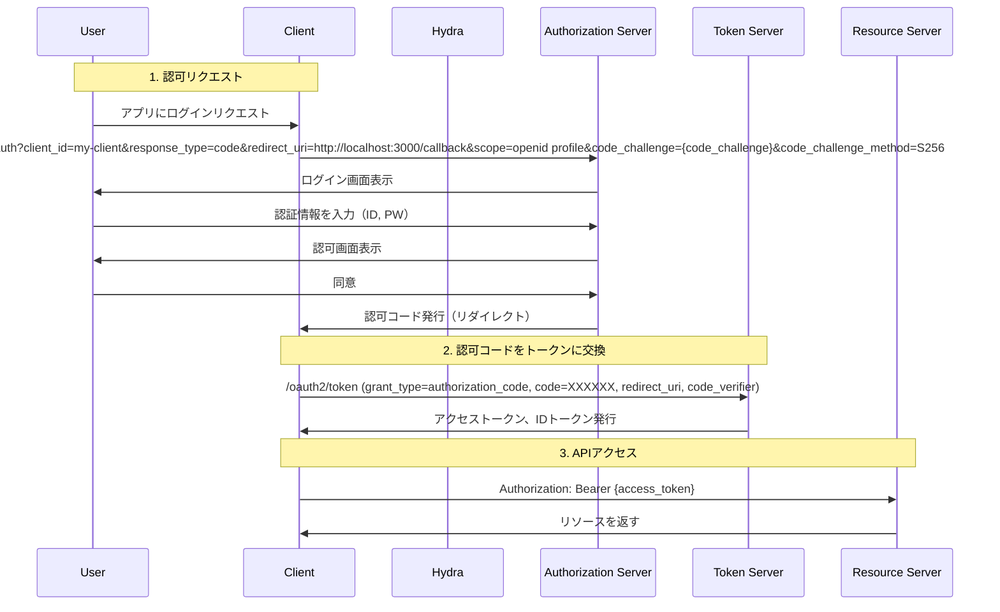

# Oryシリーズ

- Ory Kratos - ユーザー管理、認証、セッション管理を提供する ID プロバイダー  

ユーザー登録・ログイン  
セッション管理  

- Ory Hydra	- OAuth2/OIDC (OpenID Connect) プロバイダー  
OAuth2.0 & OIDC  
トークン管理  
外部IdPとの連携  
Consent UI  

- Ory Keto - 分散型のアクセス制御システム (Google Zanzibar に似たアーキテクチャ)  
RBAC (Role-Based Access Control) / ABAC (Attribute-Based Access Control)  
Graphベースのリレーション管理(Tuples)  
ポリシー変更の即時適用  

- Ory Oathkeeper - APIゲートウェイ用のリバースプロキシとアクセス管理

リバースプロキシとして動作し、リクエストの認証・認可を行う
認証 (JWT, OAuth2, API Key, Session Cookie)
ポリシーベースのアクセス制御 (RBAC, ABAC, IP制限)
JSON Web Tokens (JWT) の発行・検証


# Ory Hydraについて調べる

https://github.com/ory/hydra

認可サーバーの機能を提供する  

https://www.ory.sh/docs/hydra/self-hosted/install  

Hydraの注意文  
OryシリーズのAPIはアクセス制御が備わっていない。  
APIに送信されるリクエストはすべて認証済みかつ認可済みとして扱われる→この状態のままAPIを公開するのは危険なのでOry Oathkeeper等をつかい、APIを保護すべき  

## 環境構築

バックエンドでPostgresqlが必要らしい

公式のDocker手順
```
docker pull oryd/hydra:v2.3.0
docker run --rm -it oryd/hydra:v2.3.0 help
```

↑DBがない→動くのか？
- docker hub  
https://hub.docker.com/r/oryd/hydra  

これ本体だけっぽい

ビルドにはプロダクションビルドと開発用ビルドがあるらしい。  


## OAuth

OAuth 2.0のクイックスタート  
https://www.ory.sh/docs/hydra/self-hosted/quickstart

```
docker compose -f quickstart.yml \
    -f quickstart-postgres.yml \
    up \
    --build
```

↑buildだと色々必要そうで面倒なので、buildなしでやる

```
docker compose -f quickstart.yml \
    -f quickstart-postgres.yml \
    up \
```

buildは起動ついでにローカルイメージのOryシリーズを更新するみたい

- クイックスタート共通
https://github.com/ory/hydra/blob/master/quickstart.yml  


- postgresql用  
https://github.com/ory/hydra/blob/master/quickstart-postgres.yml

２つのファイルを重ね合わせる結果を確認するコマンド
`docker compose -f quickstart.yml -f quickstart-postgres.yml config`

OAuth2.0クライアントはポート4444と4445を使用する
4444→パブリックエンドポイント
4445→管理エンドポイント

### エンドポイントについて

Ory hydraはGoの本番環境のHTTPサーバーを実行するベストプラクティスをすべて実装しているが本番に直接接続するのはおすすめしないとのこと→APIゲートウェイもしくはロードバランサーの背後で実行すべきらしい

Ory Hydraは2つのポートを介してAPIを提供する  
パブリックポート（デフォルト 4444）
管理ポート（デフォルト 4445）
通常は１プロセスで２つのポートを受け付けるのをおすすめするとのこと  
高可用性構成の場合、初期起動はコンテナ１つでやり、DBの初期化フェーズが完了したあと、コンテナを増やすのがおすすめとのこと

パブリックポートはパブリックなインターネットからのアクセスを受け付ける  
管理エンドポイントはパブリックからアクセスできるように公開してはいけない  
`/clients`などは一部公開してもよいが、適切に保護すべき　

- パブリックポートに属するエンドポイント  
    - /.well-known/jwks.json
    - /.well-known/openid-configuration
    - /oauth2/auth
    - /oauth2/token
    - /oauth2/revoke
    - /oauth2/fallbacks/consent
    - /oauth2/fallbacks/error
    - /oauth2/sessions/logout
    - /userinfo

- 管理ポートに属するエンドポイント
    - /clenets
    - /keys
    - /health
    - /admin/metrics/prometheus
    - /admin/version
    - /oauth2/auth/requests
    - /oauth2/introspect
    - /oauh2/flush


## OAuth2.0 クライアントがエンドポイントを利用するためのコマンド実行(Client Credentials Flowの例)

「OAuth 2.0 のクライアントを作成する」→認可サーバーに「このアプリは OAuth 2.0 を使ってリソースにアクセスしたい」という情報を登録すること

クライアントを登録することで、以下の情報を設定できる
- client_id	クライアントを識別するための ID (公開情報)。
- client_secret	クライアントの秘密鍵 (パスワードのようなもの)。
- grant_types	どの認可フローを使用するか (client_credentials,authorization_code など)。
- redirect_uris	認可コードフローで使用するリダイレクト URI (Web アプリなどで必要)。
- scope	クライアントが要求できる権限 (例: read:user, write:posts)

```
client=$(docker compose -f quickstart.yml exec hydra \
    hydra create client \
    --endpoint http://127.0.0.1:4445/ \
    --format json \
    --grant-type client_credentials)

# We parse the JSON response using jq to get the client ID and client secret:
client_id=$(echo $client | jq -r '.client_id')
client_secret=$(echo $client | jq -r '.client_secret')
```

↑流れ
1. コマンドを実行するとjsonが返ってくる
2. jqでパースする

毎回やると返ってくるclient_idが違う

clientの例
```
echo $client 
{"client_id":"eda21cdf-ee19-4f3e-bb50-2c6e204ed0e1","client_name":"","client_secret":"Kkk1skc-YM_b2_I1.sZBE7vCKK","client_secret_expires_at":0,"client_uri":"","created_at":"2025-02-10T15:27:58Z","grant_types":["client_credentials"],"jwks":{},"logo_uri":"","metadata":{},"owner":"","policy_uri":"","registration_access_token":"ory_at_Nz9OkYc13MfyjXGxiV9qFiItMMMmO7Bg5U5Qi4WYa0U.yqzJs5vZZlZSFDGRCd5KXG14mzIkxoaqqDQjrA7isyo","registration_client_uri":"http://127.0.0.1:4444/oauth2/register/","request_object_signing_alg":"RS256","response_types":["code"],"scope":"offline_access offline openid","skip_consent":false,"skip_logout_consent":false,"subject_type":"public","token_endpoint_auth_method":"client_secret_basic","tos_uri":"","updated_at":"2025-02-10T15:27:58.16809Z","userinfo_signed_response_alg":"none"}
```


### アクセストークンの取得

```
docker compose -f quickstart.yml exec hydra \
  hydra perform client-credentials \
  --endpoint http://127.0.0.1:4444/ \
  --client-id "$client_id" \
  --client-secret "$client_secret"
```

### トークンの詳細確認  

取得したアクセストークンが有効かどうかを確認 するために、トークンイントロスペクション（Token Introspection）を実行
エンドポイント 4444 は認証、4445 はイントロスペクション

```
docker compose -f quickstart.yml exec hydra \
  hydra introspect token \
  --format json-pretty \
  --endpoint http://127.0.0.1:4445/ \
  <アクセストークン>
```

##  OAuth 2.0 Authorization Code Grant の実行
認可コードグラント  




### クライアントに対応するclient情報の払い出し

```
code_client=$(docker compose -f quickstart.yml exec hydra \
    hydra create client \
    --endpoint http://127.0.0.1:4445 \
    --grant-type authorization_code,refresh_token \
    --response-type code,id_token \
    --format json \
    --scope openid --scope offline \
    --redirect-uri http://127.0.0.1:5555/callback)
```

- hydra create client: HydraのAPIをつかって新しいOAuth Clientを作成
- --endpoint http://127.0.0.1:4445: Hydra の管理エンドポイント（ポート 4445）を指定
    authorization_code: 認可コードフローを有効化  
    refresh_token: リフレッシュトークンの利用を許可  

- --response-type code,id_token
    code: 認可コードフローを使用
    id_token: OpenID ConnectのIDトークンを取得

- --format json json 形式

- --scope openid --scope offline  
    openid: OpenID Connect の ID トークンを要求  
    offline: リフレッシュトークンを取得可能にする  

- --redirect-uri http://127.0.0.1:5555/callback 認可コードのリダイレクト先

```
echo $code_client
{"client_id":"93846eb3-ede6-4f74-8325-09207a60bb7c","client_name":"","client_secret":"0tX1-UZLT4d7z_tLXVkE4ljMEL","client_secret_expires_at":0,"client_uri":"","created_at":"2025-02-10T16:06:19Z","grant_types":["authorization_code","refresh_token"],"jwks":{},"logo_uri":"","metadata":{},"owner":"","policy_uri":"","redirect_uris":["http://127.0.0.1:5555/callback"],"registration_access_token":"ory_at_TKZj2aO8d9QTQ0YXYoPPArywUqHzwJ5WN-Z5t3MLJAc.5aKVMKoQg5WNL65SM0AUJ-xKblnnHT1DFE1d_ZNRibo","registration_client_uri":"http://127.0.0.1:4444/oauth2/register/","request_object_signing_alg":"RS256","response_types":["code","id_token"],"scope":"openid offline","skip_consent":false,"skip_logout_consent":false,"subject_type":"public","token_endpoint_auth_method":"client_secret_basic","tos_uri":"","updated_at":"2025-02-10T16:06:18.733302Z","userinfo_signed_response_alg":"none"}
```


### client_id, client_secretの取得

```
code_client_id=$(echo $code_client | jq -r '.client_id')
code_client_secret=$(echo $code_client | jq -r '.client_secret')
```

### 認可コードフローの実行（ドキュメント）

↓手動テストやデモをやるコマンドらしい
https://www.ory.sh/docs/hydra/cli/hydra-perform-authorization-code


```
docker compose -f quickstart.yml exec hydra \
    hydra perform authorization-code \
    --client-id $code_client_id \
    --client-secret $code_client_secret \
    --endpoint http://127.0.0.1:4444/ \
    --port 5555 \
    --scope openid --scope offline
```

- hydra perform authorization-code: 認可コードフローを実行。
- --client-id $code_client_id: 先ほど作成したクライアントの ID。
- --client-secret $code_client_secret: クライアントシークレット。
- --endpoint http://127.0.0.1:4444/: 認可エンドポイント（トークンサーバー）。
- --port 5555: ローカルサーバーを 5555 番ポートで起動。
- --scope openid --scope offline: ID トークンとリフレッシュトークンを取得。

リダイレクトエンドポイントがターミナル上に表示される→`http://127.0.0.1:5555/`
アクセスしてログインする。
メアドとパスワードは枠の横に書いてある。

認可を許可すると、アプリ(3000)から5555/callbackにリダイレクトされ

### 認証コードフローの実行（APIベース）の調査

- エンドポイント

認可リクエスト  
GET /oauth2/auth
client_id	クライアントのID
response_type=code	認可コードフローを示す
redirect_uri	認可後のリダイレクト先
scope	要求するスコープ
state	CSRF対策用の値

アクセストークン発行
POST /oauth2/token

grant_type=authorization_code	認可コードフローを指定
code	/oauth2/auth で発行された認可コード
redirect_uri	認可リクエストで指定したリダイレクトURI
client_id	クライアントID
client_secret	クライアントシークレット（機密クライアントのみ）

トークンの有効性確認・詳細確認
POST /oauth2/introspect
token	確認したいトークン
client_id	クライアントID
client_secret	クライアントシークレット

トークンの失効
POST /oauth2/revoke

## 認可コードフロー+PKCEをやってみる

クライアントの登録  
```
code_client=$(docker compose -f quickstart.yml exec hydra \
    hydra create client \
    --endpoint http://127.0.0.1:4445 \
    --id my-client \
    --grant-type authorization_code,refresh_token \
    --response-type code,id_token \
    --format json \
    --scope openid --scope profile --scope offline \
    --redirect-uri http://127.0.0.1:5555/callback)
```

登録の確認
```
docker compose -f quickstart.yml exec hydra \
    hydra get client my-client --endpoint http://127.0.0.1:4445
```

Goのプログラムでうまくできないので、一旦放置

## curlでPKCEやる

code_verifier と code_challenge を生成。
/oauth2/auth へリダイレクトして認可コードを取得。
GET /oauth2/auth/requests/login で認証リクエストを取得。
PUT /oauth2/auth/requests/login/accept でログインを承認。
/oauth2/token でアクセストークンを取得（code_verifier を利用）。
access_token を使ってAPIにアクセス。

Hydra登録時のredirect_uriは認可コードを受け取るところを指定する。
curlだと無理なので、受け取り用サーバーが必要


ログインプロバイダーの用意も必要


```
CODE_VERIFIER=$(openssl rand -base64 48 | tr -d '=+/')
CODE_CHALLENGE=$(echo -n $CODE_VERIFIER | sha256sum | awk '{print $1}' | xxd -r -p | base64 | tr -d '=+/')

echo "CODE_VERIFIER: $CODE_VERIFIER"
echo "CODE_CHALLENGE: $CODE_CHALLENGE"

```


クライアント登録
```
curl -X POST "http://localhost:4445/admin/clients" \
  -H "Content-Type: application/json" \
  -d '{
    "client_id": "test-client",
    "grant_types": ["authorization_code"],
    "redirect_uris": ["http://localhost:5555/callback"],
    "response_types": ["code"],
    "scope": "openid profile",
    "token_endpoint_auth_method": "none"
  }'
```


認可リクエスト
```
STATE=$(openssl rand -hex 16)
AUTH_URL="http://localhost:4444/oauth2/auth?response_type=code&client_id=test-client&redirect_uri=http://localhost:5555/callback&scope=openid profile&code_challenge=$CODE_CHALLENGE&code_challenge_method=S256&state=$STATE"

echo "以下のURLをブラウザで開いて認可コードを取得してください:"
echo "$AUTH_URL"
```

アクセストークンの取得

```
AUTH_CODE="<ブラウザで取得した認可コード>"

curl -X POST "http://localhost:4444/oauth2/token" \
  -H "Content-Type: application/x-www-form-urlencoded" \
  -d "grant_type=authorization_code" \
  -d "client_id=test-client" \
  -d "redirect_uri=http://localhost:5555/callback" \
  -d "code=$AUTH_CODE" \
  -d "code_verifier=$CODE_VERIFIER"
```


```
AUTH_CODE="ory_ac_qBYjIvWeG07PSRUsw0YxtOFEmo9sJ9DdHqNIj_Czk4Q.-lKM2qLvlleeTe3_WZinn6nzYecN_GBUHrjs5U8ZMpM"
curl -X POST "http://localhost:4444/oauth2/token" \
  -H "Content-Type: application/x-www-form-urlencoded" \
  -d "grant_type=authorization_code" \
  -d "client_id=test-client" \
  -d "redirect_uri=http://localhost:5555/callback" \
  -d "code=$AUTH_CODE" \
  -d "code_verifier=$CODE_VERIFIER"
```

ACCESS_TOKEN="ory_at_sBrtvEN3bAGPezyHFfzbHDsLXkLZnFbKauEGfSKe8ak.85HBFtsPM1N0oOSh_abeqHc6Scph_ODYu_3W3ib1aUU"

curl -X GET "http://localhost:4444/userinfo" \
  -H "Authorization: Bearer $ACCESS_TOKEN"

## その他  

### k8s

Helm Chartあり

### 分散トレース
https://www.ory.sh/docs/self-hosted/operations/tracing  

対応してる

トレースとれるようにしたときのcompose.yml
otel-collectorも使ってみようとしたがなぜかできなかった、原因究明はまたこんど

```
services:
  sqlite:
    image: busybox
    volumes:
    - hydra-sqlite:/mnt/sqlite
    command: "chmod -R 777 /mnt/sqlite"
  hydra:
    image: oryd/hydra:v2.3.0
    build:
      context: .
      dockerfile: .docker/Dockerfile-local-build
    ports:
    - "4444:4444" # Public port
    - "4445:4445" # Admin port
    - "5555:5555" # Port for hydra token user
    command: serve -c /etc/config/hydra/hydra.yml all --dev
    volumes:
    - hydra-sqlite:/mnt/sqlite:rw
    - type: bind
      source: ./contrib/quickstart/5-min
      target: /etc/config/hydra
    pull_policy: missing
    environment:
    - DSN=sqlite:///mnt/sqlite/db.sqlite?_fk=true&mode=rwc
    - TRACING_PROVIDER=jaeger
    - TRACING_PROVIDERS_JAEGER_SAMPLING_SERVER_URL=http://jaeger:5778/sampling
    - TRACING_PROVIDERS_JAEGER_LOCAL_AGENT_ADDRESS=jaeger:6831
    - TRACING_PROVIDERS_JAEGER_SAMPLING_TRACE_ID_RATIO=1
    restart: unless-stopped
    depends_on:
    - hydra-migrate
    - sqlite
    - jaeger
    networks:
    - intranet
  hydra-migrate:
    image: oryd/hydra:v2.3.0
    build:
      context: .
      dockerfile: .docker/Dockerfile-local-build
    environment:
    - DSN=sqlite:///mnt/sqlite/db.sqlite?_fk=true&mode=rwc
    command: migrate -c /etc/config/hydra/hydra.yml sql up -e --yes
    pull_policy: missing
    volumes:
    - hydra-sqlite:/mnt/sqlite:rw
    - type: bind
      source: ./contrib/quickstart/5-min
      target: /etc/config/hydra
    restart: on-failure
    networks:
    - intranet
    depends_on:
    - sqlite
  consent:
    environment:
    - HYDRA_ADMIN_URL=http://hydra:4445
    image: oryd/hydra-login-consent-node:v2.3.0
    ports:
    - "3000:3000"
    restart: unless-stopped
    networks:
    - intranet
  jaeger:
    image: jaegertracing/all-in-one:1.19.2
    ports:
    - "16686:16686" # The UI port
    networks:
    - intranet
networks:
  intranet:
volumes:
  hydra-sqlite:
```

### prometheusのエンドポイント
http://{host}:4445/admin/metrics/prometheus

### ログ
https://www.ory.sh/docs/self-hosted/operations/logging  
ログ出力は stdout/stderr に送信される
ログの送信先を変更するオプションはない

### データベース  
https://www.ory.sh/docs/self-hosted/deployment

#### インメモリ  
DSNをmemoryにする

#### 永続化

PostgreSQL、MySQL、SQLite、CockroachDBをサポート


### 認証フロー
- Authorization Code Flow	クライアントがユーザーの認可を得てアクセストークンを取得する
- Client Credentials Flow	クライアント自身がアクセストークンを取得する
- Implicit Flow	(非推奨) クライアントが直接アクセストークンを取得する
- Resource Owner Password Credentials (ROPC) Flow	(非推奨) ユーザーの資格情報をクライアントが直接使用する。

## OIDC

OIDCを使う場合は外部IdPが必要

